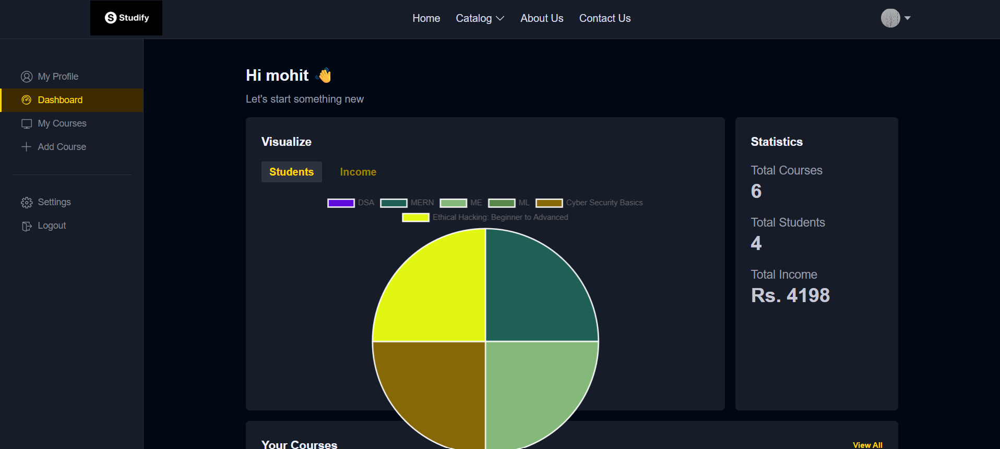
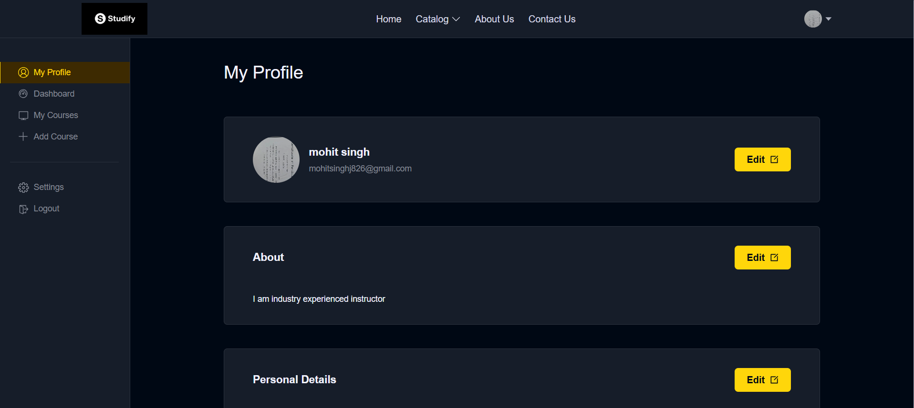
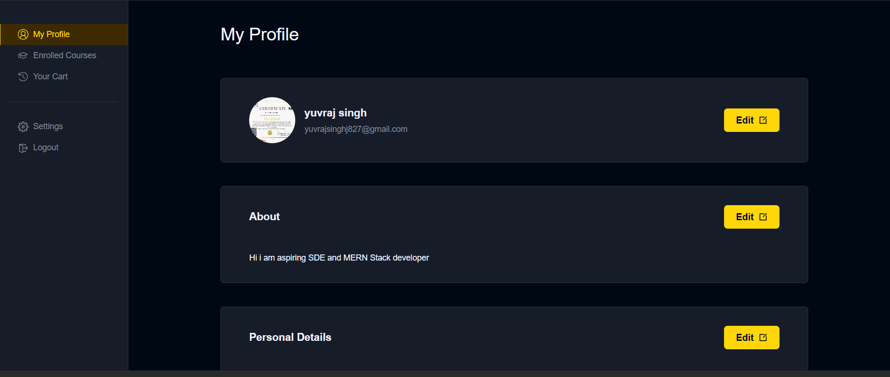
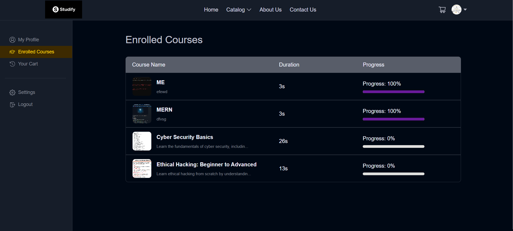

# Studify

A full-stack Learning Management System (LMS) built using the MERN stack.

The goal of this project was to understand how a real-world ed-tech platform works by implementing authentication, course management, payments, media uploads, and role-based dashboards.

## Live Demo

Frontend:
https://studify-frontend-git-main-yuvraj-singh-s-projects3.vercel.app

Backend API:
https://studify-backend-7ghk.onrender.com

---

## Features

### Student
- Create account and login
- Browse available courses
- Purchase courses using Razorpay
- Watch course videos
- Track course progress
- Rate and review purchased courses
- Update profile

### Instructor
- Create and manage courses
- Upload thumbnails and lecture videos
- Add sections and lectures
- Publish or edit courses
- View enrolled students

---

## Tech Stack

### Frontend
- React.js
- Redux Toolkit
- Tailwind CSS
- React Router

### Backend
- Node.js
- Express.js
- MongoDB
- Mongoose

### Other Tools
- Cloudinary
- Razorpay
- JWT Authentication
- Bcrypt
- Render
- Vercel

---

## 📸 Screenshots

### 🏠 Home Page


---

### 📊 Instructor Dashboard



---

### 👨‍🏫 Instructor Profile



---

### 👤 Student Profile



---

### 📚 Enrolled Courses



---

## Run Locally

Clone the project

```bash
git clone https://github.com/yuv400/Studify.git
```

Install dependencies

```bash
npm install
```

Install client

```bash
cd client
npm install
```

Install server

```bash
cd ../server
npm install
```

Run

```bash
npm run dev
```

---

## Environment Variables

### Backend

```env
PORT=
MONGODB_URL=
JWT_SECRET=
CLOUD_NAME=
API_KEY=
API_SECRET=
RAZORPAY_KEY=
RAZORPAY_SECRET=
CLIENT_URL=
```

### Frontend

```env
REACT_APP_BASE_URL=https://studify-backend-7ghk.onrender.com/api/v1
```

---

## What I Learned

Building this project helped me understand:

- Authentication using JWT
- Role-based authorization
- REST API development
- MongoDB data modelling
- Payment gateway integration
- File uploads with Cloudinary
- State management using Redux
- Deploying full-stack applications

---

## Challenges Faced

- Managing multiple user roles (Student & Instructor)
- Integrating Razorpay payment verification
- Handling secure JWT authentication
- Uploading videos and images using Cloudinary
- Deploying frontend and backend separately while configuring CORS

---

## Author

**Yuvraj Singh**

GitHub:
https://github.com/yuv400

LinkedIn:
https://www.linkedin.com/in/yuvraj-singh-312581290/